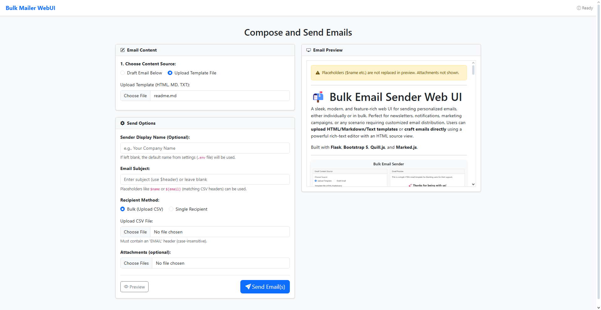

# 📬 Bulk Email Sender Web UI

A sleek, modern, and feature-rich web UI for sending personalized emails, either individually or in bulk. Perfect for newsletters, notifications, marketing campaigns, or any scenario requiring customized email distribution. Users can **upload HTML/Markdown/Text templates** or **craft emails directly** using a powerful rich-text editor with an HTML source view.

Built with **Flask** and **Tailwind CSS** for a clean, responsive, and utility-first frontend experience, along with **Quill.js** and **Marked.js**.

---

<p align="center">
  <!-- ** ACTION REQUIRED: Please replace this screenshot with a new one reflecting the Tailwind CSS UI! ** -->
  
  <br><em>(Current screenshot may show older Bootstrap version)</em>
</p>

---

## ✨ Key Features

*   **⚙️ Flexible Email Content Creation**:
    *   **Upload Templates**: Use existing `.html`, `.htm`, `.md`, or `.txt` files. Markdown is automatically converted to HTML. Plain text is wrapped nicely.
    *   **Draft In-App**: Utilize the **Quill Rich Text Editor** for easy formatting or switch to the **HTML Source** tab for precise control.
*   **📧 Multiple Recipient Modes**:
    *   **Bulk Sending**: Upload a `.csv` file. Requires an email column (looks for `email`, `email address`, etc., case-insensitive).
    *   **Single Recipient**: Quickly send a test or one-off email by typing the address directly.
*   **🎨 Dynamic Personalization**:
    *   Use placeholders like `$name` or `${header}` in your subject and email body (matching your CSV column headers) for personalized messages. **(See 'Using Variables' section below)**
*   **🖼️ Enhanced Live Email Preview**:
    *   Instantly see how your drafted or uploaded content will render before sending.
    *   **Desktop & Mobile Views**: Toggle between a full-width desktop preview and a constrained mobile-width preview using dedicated tabs.
    *   *(Note: Placeholders are not substituted in the preview).*
    *   Improved Markdown link handling for robustness and security (`rel="noopener noreferrer"` added to external links).
*   **📎 Attachment Support**:
    *   Easily attach one or more files to your emails.
*   **📄 Filename Display**:
    *   Selected filenames for templates, CSVs, and attachments are now displayed for better user experience.
*   **👤 Custom Sender Name**:
    *   Optionally override the default sender display name (set in `.env`) for specific campaigns.
*   **✉️ HTML & Plain Text**:
    *   Automatically generates both HTML and plain text versions of your email for compatibility across different email clients.
*   **🔐 Secure Configuration**:
    *   Keep your Freesend API Key safe using a `.env` file. No hardcoding needed.
    *   Uses the Freesend API for reliable email delivery.
*   **📊 Detailed Results & Logging**:
    *   Redirects to a results page after sending, showing a summary (Sent, Failed, Skipped) and a detailed log for each attempted email.
    *   Clear success/failure/warning/info icons for quick status assessment.
*   **💡 Smart & Responsive UI**:
    *   **Modern Styling**: Built with **Tailwind CSS** for a clean, utility-first, and responsive design that adapts well to different screen sizes.
    *   **Dynamic Sections**: Form sections dynamically show/hide based on selected options (e.g., Draft vs Upload, Bulk vs Single).
    *   **Real-time Feedback**: Navbar status indicator provides feedback during processing and shows the final result summary.
    *   **Loading State**: An overlay loading indicator prevents accidental double-sends during processing.
*   **✅ Robust Error Handling**:
    *   Validates file types, checks for required inputs, handles CSV parsing errors, gracefully handles Markdown parsing issues, and provides informative Freesend API error messages.

## 💻 Tech Stack

*   **Backend**: Flask (Python)
*   **Frontend**: HTML, CSS, JavaScript
*   **Styling**: **Tailwind CSS** (via CDN for simplicity)
*   **Rich Text Editor**: Quill.js
*   **Markdown Parsing**: Marked.js (Frontend Preview), Python-Markdown (Backend Processing)
*   **Email Sending**: Freesend API (via `requests` library)
*   **Environment Variables**: `python-dotenv`

## 🛠️ Setup & Installation

Follow these steps to get the application running on your local machine for development or testing. For production deployment, see the "Running for Production" section below.

### ✅ Prerequisites

*   **Python**: Version 3.7 or newer recommended.
*   **pip**: Python package installer (usually comes with Python).
*   **Git**: For cloning the repository.
*   **(Optional but Recommended)** A Python virtual environment manager (`venv`).
*   **Freesend API Key**: Obtain one from [Freesend API Keys](https://freesend.metafog.io/docs/configuration/api-keys).

### 🚀 Installation Steps

1.  **Clone the Repository**:
    ```bash
    git clone https://github.com/SupratimRK/web-bulk-email-sender.git
    cd web-bulk-email-sender
    ```

2.  **Create and Activate a Virtual Environment**:
    *   **macOS / Linux**:
        ```bash
        python3 -m venv venv
        source venv/bin/activate
        ```
    *   **Windows (Command Prompt/PowerShell)**:
        ```bash
        python -m venv venv
        .\venv\Scripts\activate
        ```
    *(Your terminal prompt should now indicate you're in the `(venv)`)*

3.  **Install Dependencies**:
    ```bash
    pip install -r requirements.txt
    ```

4.  **Configure Environment Variables**:
    *   Copy the example environment file:
        ```bash
        cp .env.example .env
        ```
    *   Open the newly created `.env` file and fill in your `from_email` and `FREESEND_API_KEY`.
        ```
        display_name="Your Name or Company"
        from_email="your_display_email@yourdomain.com"
        FREESEND_API_KEY="YOUR_FREESEND_API_KEY"
        FREESEND_API_URL="https://freesend.metafog.io/api/send-email"
        ```
    *   **`display_name`**: (Optional) The name shown as the sender.
    *   **`from_email`**: (Required) The email address that recipients will see as the sender.
    *   **`FREESEND_API_KEY`**: (Required) Your API key from Freesend.
    *   **`FREESEND_API_URL`**: (Optional) The Freesend API endpoint. Only change if you have a custom setup.

5.  **Run the Application**:
    ```bash
    flask run
    ```
    *   The application will typically run on `http://127.0.0.1:5000/`.

## 🐳 Running with Docker (Coming Soon)

## 🚀 Running for Production (e.g., Render, Heroku)

This application is designed to be easily deployable to platforms like Render or Heroku. Ensure your hosting platform supports Python/Flask applications and allows you to set environment variables.

### Render Deployment Notes:

*   **Build Command**: `pip install -r requirements.txt`
*   **Start Command**: `gunicorn --worker-class gevent --workers 4 --bind 0.0.0.0:$PORT app:app`
    *   *(Note: `gevent` and `gunicorn` will need to be added to `requirements.txt` for production deployments. `gevent` is recommended for handling concurrent requests efficiently.)*
*   **Environment Variables**: Set `FLASK_SECRET_KEY`, `FROM_EMAIL`, and `FREESEND_API_KEY` in your Render dashboard.
*   **Health Check Path**: `/health`
*   **Automatic Deployment**: Configure Render to auto-deploy from your GitHub repository.

## 💡 Using Variables in Templates and Subjects

To personalize your emails, you can include placeholders in your email templates (HTML/Markdown/Text) and subject lines. These placeholders will be replaced with data from your CSV file.

**Example CSV (`recipients.csv`):**

```csv
email,name,company,city
recipient1@example.com,Alice,ABC Corp,New York
recipient2@example.com,Bob,XYZ Inc,London
```

**Example Email Template Content:**

```html
<h1>Hello ${name},</h1>
<p>We hope this email finds you well in ${city}.</p>
<p>Your company, ${company}, is doing great!</p>
<p>Best regards,<br>The Team</p>
```

**Example Subject Line:**

`Special Offer for ${name} from ${company}`

**How it works:**

*   The application reads your CSV file's header row.
*   Any text in your template or subject that matches `$header` or `${header}` (where `header` is a column name from your CSV) will be replaced with the corresponding value for each recipient.
*   The matching is case-insensitive.

## 🤝 Contributing

Contributions are welcome! If you have suggestions for improvements, bug fixes, or new features, please open an issue or submit a pull request.

## 📄 License

This project is licensed under the MIT License - see the [LICENSE](LICENSE) file for details.

## 📞 Contact

For questions or feedback, please open an issue on the GitHub repository.

---

### Happy Emailing! 🚀