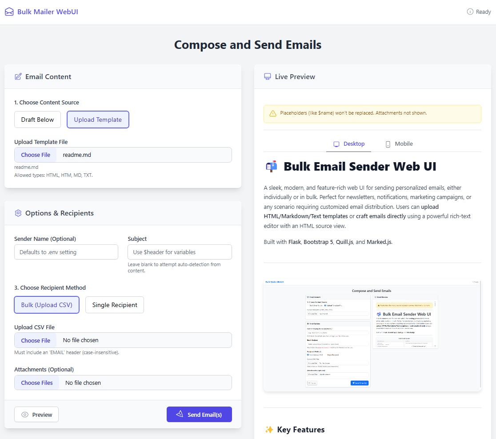

# 📬 Bulk Email Sender Web UI

A sleek, modern, and feature-rich web UI for sending personalized emails, either individually or in bulk. Perfect for newsletters, notifications, marketing campaigns, or any scenario requiring customized email distribution. Users can **upload HTML/Markdown/Text templates** or **craft emails directly** using a powerful rich-text editor with an HTML source view.

Built with **Flask** and **Tailwind CSS** for a clean, responsive, and utility-first frontend experience, along with **Quill.js** and **Marked.js**.

---

<p align="center">
  <!-- ** ACTION REQUIRED: Please replace this screenshot with a new one reflecting the Tailwind CSS UI! ** -->
  
  <br><em>(Current screenshot may show older Bootstrap version)</em>
</p>

---

## ✨ Key Features

*   **⚙️ Flexible Email Content Creation**:
    *   **Upload Templates**: Use existing `.html`, `.htm`, `.md`, or `.txt` files. Markdown is automatically converted to HTML. Plain text is wrapped nicely.
    *   **Draft In-App**: Utilize the **Quill Rich Text Editor** for easy formatting or switch to the **HTML Source** tab for precise control.
*   **📧 Multiple Recipient Modes**:
    *   **Bulk Sending**: Upload a `.csv` file. Requires an email column (looks for `email`, `email address`, etc., case-insensitive).
    *   **Single Recipient**: Quickly send a test or one-off email by typing the address directly.
*   **🎨 Dynamic Personalization**:
    *   Use placeholders like `$name` or `${header}` in your subject and email body (matching your CSV column headers) for personalized messages. **(See 'Using Variables' section below)**
*   **🖼️ Enhanced Live Email Preview**:
    *   Instantly see how your drafted or uploaded content will render before sending.
    *   **Desktop & Mobile Views**: Toggle between a full-width desktop preview and a constrained mobile-width preview using dedicated tabs.
    *   *(Note: Placeholders are not substituted in the preview).*
    *   Improved Markdown link handling for robustness and security (`rel="noopener noreferrer"` added to external links).
*   **📎 Attachment Support**:
    *   Easily attach one or more files to your emails.
*   **📄 Filename Display**:
    *   Selected filenames for templates, CSVs, and attachments are now displayed for better user experience.
*   **👤 Custom Sender Name**:
    *   Optionally override the default sender display name (set in `.env`) for specific campaigns.
*   **✉️ HTML & Plain Text**:
    *   Automatically generates both HTML and plain text versions of your email for compatibility across different email clients using `html2text`.
*   **🔐 Secure Configuration**:
    *   Keep your SMTP credentials safe using a `.env` file. No hardcoding needed.
    *   Supports standard SMTP servers and ports, including TLS.
*   **📊 Detailed Results & Logging**:
    *   Redirects to a results page after sending, showing a summary (Sent, Failed, Skipped) and a detailed log for each attempted email.
    *   Clear success/failure/warning/info icons for quick status assessment.
*   **💡 Smart & Responsive UI**:
    *   **Modern Styling**: Built with **Tailwind CSS** for a clean, utility-first, and responsive design that adapts well to different screen sizes.
    *   **Dynamic Sections**: Form sections dynamically show/hide based on selected options (e.g., Draft vs Upload, Bulk vs Single).
    *   **Real-time Feedback**: Navbar status indicator provides feedback during processing and shows the final result summary.
    *   **Loading State**: An overlay loading indicator prevents accidental double-sends during processing.
*   **✅ Robust Error Handling**:
    *   Validates file types, checks for required inputs, handles CSV parsing errors, gracefully handles Markdown parsing issues, and provides informative SMTP error messages.

## 💻 Tech Stack

*   **Backend**: Flask (Python)
*   **Frontend**: HTML, CSS, JavaScript
*   **Styling**: **Tailwind CSS** (via CDN for simplicity)
*   **Rich Text Editor**: Quill.js
*   **Markdown Parsing**: Marked.js (Frontend Preview), Python-Markdown (Backend Processing)
*   **Email Generation**: Standard Python `email` library, `smtplib`
*   **HTML to Text**: `html2text`
*   **Environment Variables**: `python-dotenv`

## 🛠️ Setup & Installation

Follow these steps to get the application running on your local machine for development or testing. For production deployment, see the "Running for Production" section below.

### ✅ Prerequisites

*   **Python**: Version 3.7 or newer recommended.
*   **pip**: Python package installer (usually comes with Python).
*   **Git**: For cloning the repository.
*   **(Optional but Recommended)** A Python virtual environment manager (`venv`).

### 🚀 Installation Steps

1.  **Clone the Repository**:
    ```bash
    git clone https://github.com/SupratimRK/web-bulk-email-sender.git
    cd web-bulk-email-sender
    ```

2.  **Create and Activate a Virtual Environment**:
    *   **macOS / Linux**:
        ```bash
        python3 -m venv venv
        source venv/bin/activate
        ```
    *   **Windows (Command Prompt/PowerShell)**:
        ```bash
        python -m venv venv
        .\venv\Scripts\activate
        ```
    *(Your terminal prompt should now indicate you're in the `(venv)`)*

3.  **Install Dependencies**:
    ```bash
    pip install -r requirements.txt
    ```

4.  **Configure Environment Variables**:
    *   **Copy the example file**:
        ```bash
        cp .env.example .env
        ```
        *(On Windows, you might use `copy .env.example .env`)*
    *   **Edit the `.env` file** with your actual SMTP credentials and desired default display name. See the section below for details.

### 🔒 Environment Variables (`.env` File)

Create a file named `.env` in the project root directory (where `app.py` is located) and add the following variables. **This file contains secrets and should NOT be committed to Git.**

```dotenv
# .env - DO NOT COMMIT THIS FILE TO GIT!

# Display Name shown in the 'From' field by default (can be overridden in UI)
display_name="Your Default Sender Name"

# Your sending email address (must match SMTP login)
sender_email="your_email@example.com"

# Your email account password or an App Password (Recommended!)
# For Gmail, enable 2FA and generate an App Password:
# https://support.google.com/accounts/answer/185833?hl=en
password="your_password_or_app_password"

# SMTP Server Configuration (Examples below)
MAILER_HOST="smtp.yourprovider.com" # e.g., smtp.gmail.com, smtp.mailersend.net
MAILER_PORT="587"                   # Common ports: 587 (TLS), 465 (SSL), 25 (Insecure)

# Flask Secret Key (REQUIRED for sessions/flash messages)
# Generate a strong random key, e.g., using: python -c 'import secrets; print(secrets.token_hex(16))'
# CHANGE THIS FROM THE DEFAULT VALUE FOR PRODUCTION!
FLASK_SECRET_KEY="a_default_but_less_secure_key_please_change_me"
```

**Important Notes**:

*   **Security**: **NEVER** commit your `.env` file to version control (Git). Ensure `.env` is in your `.gitignore` file.
*   **App Passwords**: Using App Passwords is highly recommended for security if your provider supports them (like Gmail).
*   **SMTP Settings**: Double-check `MAILER_HOST` and `MAILER_PORT` for your email provider. Port 587 typically uses STARTTLS (which the code handles). Port 465 usually requires `smtplib.SMTP_SSL` (would need a minor code adjustment in `app.py`).
*   **Flask Secret Key**: **MUST** be changed to a unique, random, secret value for production deployments.

## 🚀 How to Use

1.  **Start the Flask Development Server**:
    ```bash
    # Ensure you are in the project directory and your virtualenv is active
    python app.py
    ```
    The application will typically start on `http://127.0.0.1:5000/`. Open this URL in your web browser. (See "Running for Production" for deployment).

2.  **Choose Content Source**:
    *   Select "Draft Below" to use the editor.
    *   Select "Upload Template" to browse for an `.html`, `.md`, or `.txt` file.

3.  **Create/Upload Email Content**:
    *   **If Drafting**: Use the Rich Text Editor or switch to the "HTML Source" tab.
    *   **If Uploading**: Click "Choose File", select your template file. The filename will appear.

4.  **Set Subject & Sender Name**:
    *   Enter the **Email Subject**. You can use placeholders (e.g., `Welcome, $name!`). See **"How the Subject is Determined"** below.
    *   Optionally, enter a **Sender Display Name** to override the default from `.env`.

5.  **Choose Recipient Method**:
    *   Select "Bulk (Upload CSV)".
    *   Select "Single Recipient".

6.  **Provide Recipients**:
    *   **If Bulk**: Click "Choose File" under "Upload CSV File", select your `.csv` file. The filename will appear. See **"Example CSV File"** below.
    *   **If Single**: Enter the recipient's email address in the input field.

7.  **Add Attachments (Optional)**:
    *   Click "Choose Files" under "Attachments" and select one or more files. The selected filename(s) or count will appear.

8.  **Preview (Recommended)**:
    *   Click the "Preview" button.
    *   Use the **"Desktop"** and **"Mobile"** tabs within the preview panel to visualize the email on different screen sizes.
    *   Check formatting, especially if using Markdown or complex HTML. *(Remember: Placeholders like `$name` are not replaced in the preview).*

9.  **Send**:
    *   Click the "Send Email(s)" button. A loading indicator will appear while processing.

10. **Review Results**:
    *   You'll be redirected to the results page.
    *   Check the summary status message at the top and in the navbar.
    *   Review the detailed log for the status of each individual email (Success, Failed, Skipped, Warning). Error messages will be shown for failures.

11. **Go Back**: Click "Go Back & Send More" to return to the main form.

## 📄 Example CSV File for Bulk Sending

When using the "Bulk (Upload CSV)" option, your CSV file structure is crucial.

*   **Required Header**: It **MUST** contain a column header for email addresses. The application looks for common names like `email`, `email address`, `email_address`, `e-mail`, or `recipient` (case-insensitive). It will also try to find any header containing `mail` if the common ones aren't present.
*   **Optional Headers**: Any other column headers can be used as variables for personalization in your subject and email body.
*   **Encoding**: UTF-8 encoding (with or without BOM) is recommended. Latin-1 is supported as a fallback.
*   **Delimiter**: Standard comma (`,`) delimiter is expected. The app attempts to sniff the dialect but defaults to comma-separated.

**Example `recipients.csv` file:**

```csv
Email,FirstName,LastName,Product,DiscountCode
alice@example.com,Alice,Smith,SuperWidget,SUMMER20
bob@domain.org,Bob,Jones,MegaGadget,WELCOME10
charlie@email.net,Charlie,Brown,TurboTool,
diana@sample.co,Diana,Prince,SuperWidget,SAVEBIG5
,"","",,""  # Example of a potentially empty row (will be skipped)
frank@test.io,Frank,,,SAVE15 # Example with missing data
```

**Key points from the example:**

*   The `Email` column is present and contains the recipient addresses.
*   `FirstName`, `LastName`, `Product`, `DiscountCode` are optional headers used for personalization.
*   Some rows might have missing data (like Charlie's DiscountCode or Frank's LastName/Product). The corresponding placeholder will be replaced with an empty string.
*   Empty rows are skipped automatically.

## 🔑 Understanding Variables & Personalization

You can personalize both the **Subject** and the **Email Body** using data from your CSV file (when in Bulk mode).

*   **Syntax**: Use `$` followed by the header name (e.g., `$firstname`) OR `${header_name}` (e.g., `${product}`). The curly brace syntax `${...}` is useful if the placeholder is immediately followed by other characters that could be mistaken as part of the name (e.g., `${product}s`).
*   **Matching**: The placeholder name **MUST** exactly match a column header in your CSV file, but the match is **case-insensitive**. So, `$firstname`, `$FirstName`, and `${FIRSTNAME}` will all correctly pull data from the `FirstName` column in the example CSV above.
*   **Replacement**: Before sending each email, the application replaces every placeholder it finds with the corresponding value from that recipient's row in the CSV.
*   **Missing Data**: If a placeholder exists in your template but the corresponding column is missing in the CSV or the cell is empty for a specific recipient, the placeholder will be replaced with an empty string (nothing).

**Example Usage (based on the CSV above):**

*   **Subject Input**: `Special Offer for $FirstName on ${Product}!`
    *   For Alice: `Special Offer for Alice on SuperWidget!`
    *   For Bob: `Special Offer for Bob on MegaGadget!`
*   **Email Body Content (HTML example)**:
    ```html
    <p>Hi $FirstName $LastName,</p>
    <p>Thanks for your interest in the ${Product}. As a valued customer, use code <strong>$DiscountCode</strong> for a special discount!</p>
    <p>Best regards,<br>The Team</p>
    ```
    *   For Alice: Renders with "Hi Alice Smith," ... "code SUMMER20..."
    *   For Charlie: Renders with "Hi Charlie Brown," ... "code ..." (empty string for DiscountCode)

**Important**: Variables are **NOT** replaced in the live Preview. The preview shows the raw template with placeholders intact.

## 🤔 How the Email Subject is Determined

The application follows this logic to set the subject line for each email:

1.  **User Input Field**: If you type anything into the "Email Subject" field on the form, that text is used as the template. Placeholders (like `$FirstName`) within this input *will* be processed using the CSV data for each recipient.
    *   **Example**: If you enter `Hello $FirstName!`, and the CSV has `FirstName` as `Alice`, the subject for Alice will be `Hello Alice!`.
2.  **`<title>` Tag (HTML Upload/Draft)**: If the "Email Subject" field is **left empty** AND the email content is determined to be HTML (either uploaded `.html`/`.htm` or drafted HTML), the application looks for a `<title>Your Subject Here</title>` tag within the HTML content. If found, the text inside the title tag is used as the subject. Placeholders are *not* processed if the subject is extracted this way.
    *   **Example**: If the HTML content has `<title>Welcome to Our Service</title>`, the subject will be `Welcome to Our Service`.
    *   **Note**: If the HTML content is empty or starts with HTML tags (like `<html>`), the application will not find a title tag and will skip this step.
    *   **Note**: If the content is Markdown or plain text, this step is skipped entirely.
    *   **Note**: If the content is HTML but does not contain a `<title>` tag, this step is skipped entirely.

3.  **First Non-Empty Line (Markdown/Text Upload or Fallback)**: If the subject field is empty AND no `<title>` tag is found (or the content is Markdown/Text), the application attempts to use the first non-empty, non-HTML-tag-like line from the email content as the subject. Placeholders are *not* processed if the subject is extracted this way.

    *   **Example**: If the content starts with `# Welcome to Our Service`, the subject will be `Welcome to Our Service`.
    *   **Note**: If the content is empty or starts with HTML tags (like `<html>`), this step is skipped entirely. 


4.  **Default Subject**: If none of the above methods yield a subject (e.g., the content starts immediately with HTML tags and has no title, and the subject field was empty), a generic default subject like `"Your Default Sender Name Information"` (using the `display_name` from `.env` or the custom one) will be used.
    *   **Example**: If the content is `<html><body>...</body></html>` and the subject field is empty, the subject will be `Your Default Sender Name Information`.
    *   **Note**: This is a fallback and should not be relied upon for meaningful subject lines.

**Recommendation**: For maximum control and personalization, **always specify your desired subject in the "Email Subject" form field**, using placeholders as needed.

## 📁 Project Structure

```
web-bulk-email-sender/
├── .env                 # Your SMTP config & secrets (!!! NOT COMMITTED !!!)
├── .env.example         # Example environment file structure
├── .gitignore           # Specifies intentionally untracked files that Git should ignore
├── app.py               # Main Flask application logic (routing, email sending)
├── requirements.txt     # Python package dependencies
├── readme.md            # This file
└── templates/
    ├── index.html       # Main form UI (editor, options, preview)
    └── result.html      # Status/result log page
```

## 🏃 Running the App for Development

```bash
# Ensure you are in the project directory and your virtualenv is active
python app.py
```

This uses the Flask development server, which is great for testing but **NOT suitable for production**. It runs by default on `http://127.0.0.1:5000`.
Open this URL in your web browser to access the application.
*(Note: The development server is not designed for high traffic or production use. For production, see the "Running for Production" section below.)*

## 🚀 Running for Production

Deploying a Flask application requires a more robust setup than the development server. Here's a recommended approach:

1.  **Use a Production WSGI Server:** Instead of `python app.py`, use a server like **Gunicorn** (popular on Linux/macOS) or **Waitress** (cross-platform).
    *   Install Gunicorn: `pip install gunicorn` (add to `requirements.txt`)
    *   Run with Gunicorn: `gunicorn --workers 3 --bind 0.0.0.0:5000 app:app` (Adjust workers and bind as needed).

2.  **Disable Debug Mode:** In `app.py`, ensure the `app.run()` call (if used at all) has `debug=False`. The WSGI server will typically bypass this, but it's a crucial setting.

3.  **Set a Strong `FLASK_SECRET_KEY`:** Generate a secure random key and set it in your `.env` file or as a system environment variable. **Do not use the default key.**

4.  **Manage Environment Variables Securely:** Do *not* commit your `.env` file. Either securely copy it to your production server (outside the web root if possible) or, better yet, set the required variables (`sender_email`, `password`, `FLASK_SECRET_KEY`, etc.) as actual environment variables on the server.

5.  **(Highly Recommended) Use a Reverse Proxy:** Set up **Nginx** or **Apache** in front of your WSGI server (Gunicorn/Waitress).
    *   The reverse proxy handles incoming internet traffic (ports 80/443).
    *   It forwards requests to your WSGI server (e.g., running on `127.0.0.1:5000`).
    *   It efficiently serves static files.
    *   It handles **HTTPS (SSL/TLS termination)** - Use Let's Encrypt for free certificates.
    *   It can provide load balancing, security headers, and rate limiting.

6.  **Run as a Service:** Configure your WSGI server (Gunicorn) to run as a background service using `systemd` (on Linux) or a similar process manager to ensure it restarts automatically.

7.  **Configure Logging:** Set up proper file or external logging for Flask and your WSGI server for monitoring and debugging production issues.

**Conceptual Production Flow:**
`User <--HTTPS--> Nginx/Apache <--HTTP--> Gunicorn/Waitress <--> Flask App`

## 🤝 Contributing & Future Development

Contributions are welcome! Please feel free to fork the repository, make changes, and submit a Pull Request. Discussing significant changes in an Issue first is recommended.

### How to Contribute

1.  **Find/Discuss**: Look through [GitHub Issues](https://github.com/SupratimRK/web-bulk-email-sender/issues) or propose an idea.
2.  **Fork**: Create your own copy.
3.  **Branch**: `git checkout -b feature/your-cool-feature`
4.  **Develop & Test**: Make changes, follow style, ensure it works.
5.  **Commit**: Use clear messages (`git commit -m "feat: Describe feature"`).
6.  **Push**: `git push origin feature/your-cool-feature`
7.  **Pull Request**: Open a PR to the `main` branch of the original repo. Describe your changes clearly.

### 💡 Potential Future Ideas & Roadmap

*   **📨 Template Management**: Save/load/manage email templates in the UI.
*   **🚦 Rate Limiting Control**: UI options for delays between sends.
*   **✅ Enhanced CSV Validation/Preview**: Preview parsed CSV data before sending.
*   **🐳 Dockerization**: `Dockerfile` and `docker-compose.yml` for easier deployment.
*   **🎨 UI Themes/Customization**: Options for visual themes.
*   **👥 Simple Contact List Management**: Basic list storage/management.
*   **🧪 Unit/Integration Tests**: Improve code quality and reliability.

## 🙏 Credits & Acknowledgements

*   **Original Concept Inspiration**: [aahnik/bulk-email-sender](https://github.com/aahnik/bulk-email-sender)
*   **Framework**: [Flask](https://flask.palletsprojects.com/)
*   **Frontend Styling**: [Tailwind CSS](https://tailwindcss.com/)
*   **Rich Text Editor**: [Quill.js](https://quilljs.com/)
*   **Markdown Rendering**: [Marked.js](https://marked.js.org/), [Python-Markdown](https://python-markdown.github.io/)
*   **HTML to Text**: [html2text](https://github.com/Alir3z4/html2text)

## 📄 License

This project is licensed under the **MIT License**. Feel free to use, modify, and distribute it, but please provide attribution.

---

### Happy Emailing! 🚀